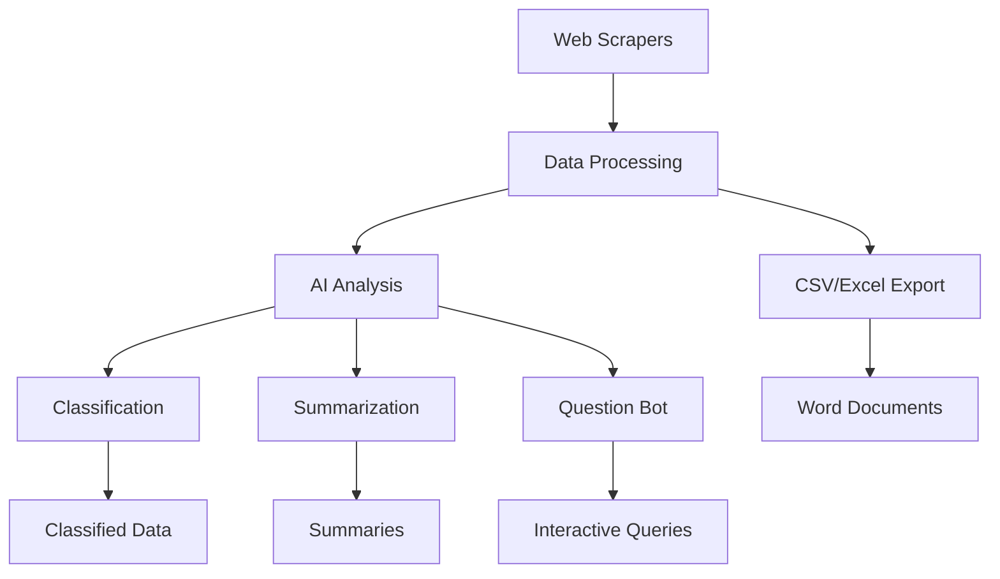

# Law Websites Web Scraping & Analysis Project

A comprehensive collection of web scrapers and AI-powered analysis tools for legal websites, designed to extract, process, and analyze legal documents and case data.

## 🏛️ Project Overview

This project consists of multiple components that work together to scrape legal data from various websites and provide AI-powered analysis including classification, summarization, and question-answering capabilities.

### Components

1. **Wonder.Legal Scraper** - Extracts legal document templates and questions
2. **Indian Kanoon Scraper** - Scrapes Indian legal case data and judgments
3. **Advocate Khoji** - Legal data scraper for advocate information
4. **Question Bot** - Interactive chatbot for legal data queries
5. **Classification System** - AI-powered legal case classification
6. **Summarization Tool** - Legal document summarization using transformers

## 🚀 Quick Start

### Prerequisites

- Python 3.8 or higher
- Web browser (Chrome/Edge) for web scraping
- Internet connection for scraping and AI features

### Installation

1. **Clone or download the project**

   ```bash
   git clone <repository-url>
   cd law_websites
   ```

2. **Install dependencies**

   ```bash
   pip install -r requirements.txt
   ```

3. **Download web drivers** (if not already present)
   - EdgeDriver is included in `wonder.legal/` folder
   - For other components, download appropriate drivers from:
     - [ChromeDriver](https://chromedriver.chromium.org/)
     - [EdgeDriver](https://developer.microsoft.com/en-us/microsoft-edge/tools/webdriver/)

## 📋 Component Documentation

### 1. Wonder.Legal Scraper

**Purpose**: Extracts legal document templates, descriptions, and related questions from wonder.legal website.

**Features**:

- Scrapes all available legal document templates
- Extracts descriptions and questions for each template
- Exports data to Excel format
- Creates organized Word documents for each template

**Usage**:

```bash
cd wonder.legal
streamlit run start.py
```

**Output**:

- `wonder_legal_data.xlsx` - Main data file
- `word_files/` - Organized Word documents for each template

**Data Structure**:

```python
{
    "Title": "Document template name",
    "Description": "Detailed description of the document",
    "Questions": "List of questions related to the document"
}
```

### 2. Indian Kanoon Scraper

**Purpose**: Scrapes legal case data, judgments, and court information from Indian Kanoon.

**Features**:

- Search-based case extraction
- Extracts case titles, authors, and full judgment text
- Configurable refresh rate for scraping
- CSV export functionality

**Usage**:

```bash
cd indian_kanoon
streamlit run Start.py
```

**Input Parameters**:

- Search term (e.g., "supreme court", "tamil nadu")
- Refresh rate (default: 2 seconds)

**Output**:

- `data.csv` - Case data with columns: title, author, data
- `links.csv` - Extracted case links

### 3. Advocate Khoji

**Purpose**: Scrapes advocate information and legal data.

**Features**:

- Location-based advocate search
- Data extraction and processing
- CSV export functionality

**Usage**:

```bash
cd advocate_khoji
streamlit run Start.py
```

**Input Parameters**:

- Location/region (e.g., "tamil nadu")
- Refresh rate for scraping

**Output**:

- `output.csv` - Extracted advocate data

### 4. Question Bot

**Purpose**: Interactive chatbot interface for querying legal data.

**Features**:

- Interactive case selection
- Integration with AI models (Gemini, LLaMA)
- Data export functionality

**Usage**:

```bash
cd question_bot
streamlit run start.py
```

**AI Models Supported**:

- Google Gemini Pro
- LLaMA 70B Instruct

### 5. Classification System

**Purpose**: AI-powered classification of legal cases by type, severity, and judgment.

**Features**:

- Automatic case type classification
- Severity assessment
- Judgment prediction
- Google Gemini AI integration

**Usage**:

```bash
cd classification
streamlit run start.py
```

**Classification Categories**:

- **Case Types**: Road accident, Crime, Marriage
- **Severity**: Death, Medical issue, Psychological trauma
- **Judgments**: Death penalty, Fine, Imprisonment

**API Configuration**:

```python
# Configure your Gemini API key
genai.configure(api_key='YOUR_API_KEY')
```

### 6. Summarization Tool

**Purpose**: Automatic summarization of legal documents using transformer models.

**Features**:

- T5-based text summarization
- Legal document preprocessing
- Configurable summary length
- Batch processing support

**Usage**:

```bash
cd summerisation
python summerize.py
```

**Models Used**:

- T5-base for summarization
- Custom text preprocessing for legal documents

## 🔧 Configuration

### API Keys

For AI-powered features, you'll need to configure API keys:

1. **Google Gemini API** (for classification and question bot):

   ```python
   # In classification/start.py and question_bot/pages/gemini.py
   genai.configure(api_key='YOUR_GEMINI_API_KEY')
   ```

2. **OpenAI API** (for LLaMA integration):
   ```python
   # In question_bot/pages/lama-70-b-instruct.py
   openai.api_key = "YOUR_OPENAI_API_KEY"
   ```

### Web Driver Configuration

The project uses Selenium for web scraping. Ensure you have the appropriate drivers:

- **EdgeDriver**: Already included in `wonder.legal/msedgedriver.exe`
- **ChromeDriver**: Download from [ChromeDriver website](https://chromedriver.chromium.org/)

## 📊 Data Flow



## 🗂️ Project Structure

```
law_websites/
├── wonder.legal/              # Wonder.Legal scraper
│   ├── start.py              # Main scraper application
│   ├── msedgedriver.exe      # Edge web driver
│   ├── wonder_legal_data.xlsx # Output data
│   └── word_files/           # Generated Word documents
├── indian_kanoon/            # Indian Kanoon scraper
│   ├── Start.py              # Main application
│   ├── indian_kanoon_bot.py  # Scraper logic
│   └── data.csv              # Output data
├── advocate_khoji/           # Advocate scraper
│   ├── Start.py              # Main application
│   ├── advocate_khoji.py     # Scraper logic
│   └── output.csv            # Output data
├── question_bot/             # Interactive chatbot
│   ├── start.py              # Main interface
│   └── pages/                # AI model integrations
├── classification/           # AI classification
│   ├── start.py              # Main application
│   └── pages/                # Model configurations
├── summerisation/            # Document summarization
│   ├── summerize.py          # Main summarization script
│   └── *.py                  # Various model implementations
├── requirements.txt          # Python dependencies
└── README.md                # This file
```

## 🚨 Important Notes

### Legal and Ethical Considerations

- **Respect robots.txt**: Always check website robots.txt files before scraping
- **Rate Limiting**: Built-in delays to avoid overwhelming target servers
- **Terms of Service**: Ensure compliance with website terms of service
- **Data Usage**: Use scraped data responsibly and in accordance with applicable laws

### Performance Considerations

- **Scraping Speed**: Adjust refresh rates based on target website capacity
- **Memory Usage**: Large datasets may require significant RAM
- **API Limits**: Be aware of API rate limits for AI services

### Troubleshooting

1. **Web Driver Issues**:

   - Ensure driver version matches your browser version
   - Check driver path configuration
   - Update drivers regularly

2. **Scraping Failures**:

   - Check internet connection
   - Verify target website accessibility
   - Review error logs in console

3. **AI Model Issues**:
   - Verify API keys are correctly configured
   - Check API quota and limits
   - Ensure model availability

## 🔮 Future Enhancements

- [ ] Database integration for data persistence
- [ ] Advanced NLP models for better legal text understanding
- [ ] Real-time monitoring and alerting
- [ ] Multi-language support
- [ ] API endpoints for external integration
- [ ] Docker containerization
- [ ] Automated testing framework

## 📝 Research Paper

This project is part of a research study comparing different AI models for legal document analysis. The research paper outline is available in `research_paper.txt`.

## 🤝 Contributing

1. Fork the repository
2. Create a feature branch
3. Make your changes
4. Test thoroughly
5. Submit a pull request

## 📄 License

This project is for educational and research purposes. Please ensure compliance with all applicable laws and website terms of service when using this software.

## 📞 Support

For issues and questions:

1. Check the troubleshooting section above
2. Review component-specific documentation
3. Check error logs and console output
4. Ensure all dependencies are properly installed

---

**Disclaimer**: This software is provided for educational and research purposes only. Users are responsible for ensuring compliance with all applicable laws, website terms of service, and ethical guidelines when using this software.
